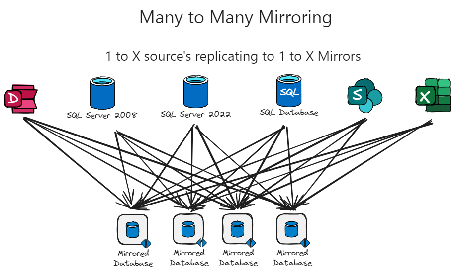
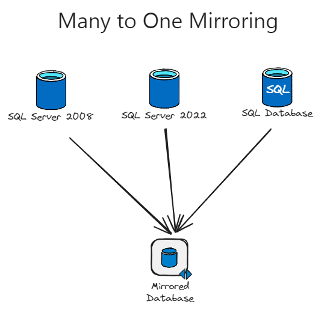
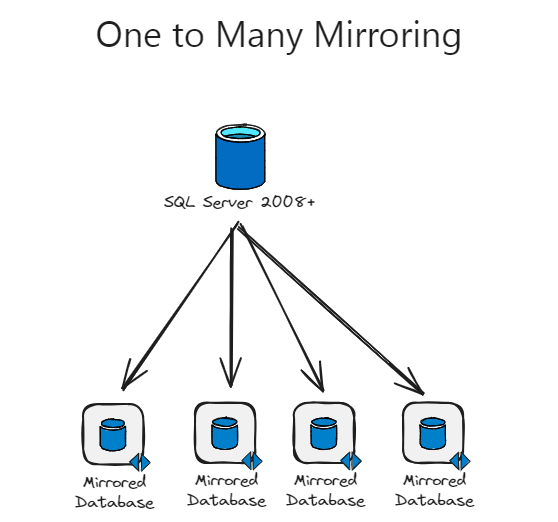

# Generic Mirroring

The aim of this POC (Proof of Concept) code, was to show how easy it is to setup [Open Mirroring](https://learn.microsoft.com/en-us/fabric/database/mirrored-database/open-mirroring) and Mirroring data.
It is completely driven by the config file, you will need to configure the config file so it connect to the correct sources and Mirrored databases.

This is an 'uber' project, including all the sources in one project.

## Sources
This project is a combination of multiple Mirroring sources. It can mirror:
1. SQL Server 2008-2022 (using Change Tracking)
1. Excel
1. CSV
1. Access
1. Sharepoint Lists
1. TODO: Dedicated SQL Pool
1. TODO: Google Big Query
1. TODO: Redshift
1. TODO: ODBC

## Many to Many Mirroring

The most recent changes allow for what I am calling ""many to many"" Mirroring.   
It allows for **1 or many sources** to be Mirrored/replicated to **1 or many Mirrored databases**.

1. Many SQL Servers all Mirroring to one Mirrored database.
If you have a multi-tenanted architecture and I want to consolidate all the reporting in one centralised hub.

1. One master source being mirrored to many difference Mirrored databases.
If you have a centralise data hub and need to push out changes to many downstream systems.

## Mirrored database as a source for CDC (SQL Server only)
The change tracking information is being collected and sent to the Mirrored database, allowing the Mirrored database to be used as a source for OLTP/raw data.

There is also a  'soft' delete option (for SQL Server) - so deletes are only marked as deleted in the Mirrored database - this allows the delete to be propigated to down stream systems.
If

## Process 
This solution will:
1. Enable Change Tracking on the source database (if needed) and on the table (if needed).  It should not interfer, if you have CDC/change tracking already enabled.
1. Create a snapshot or initial extract from SQL Server/source
1. Upload the extracted data (in parquet file) to the Mirroring Landing zone.
1. On a custom schedule per table, extract any changes on the table and upload them to the landing zone.

# Instructions
1. Compile the solution using VSCode or Visual Studio 2022 - I used Community Edition.
1. Edit the config file, to include the SQL Server, tables you want to Mirror and the SPN Application ID, SPN Secret and SPN Tenant. (All the details are in the [youtube video](https://youtu.be/Gg3YlGyy5P8), there is a [seperate youtube video](https://youtu.be/85xWqWHfWbU)for creating an SPN)
1. [Create the Mirrored database](https://youtu.be/tiHHw2Hj848) , Copy the Landing Zone to the config file. 
1. Run the program.
 
# Training and useful information

The following [Youtube playlist](https://www.youtube.com/playlist?list=PL5wR5nXbiSA6-nOaZiD6ySP7I3ifaXgjM) contains all the videos on Open Mirroring in Fabric.

